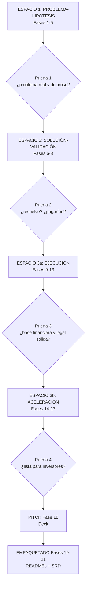

# Modelo de Negocio — AgriVision

Modo normal — archivos guardados en `./business/`.

## Idea (base visual aterrizada)

Monitoreo inteligente de broca del café (Coffee Berry Borer) con tecnología 5G (Fifth Generation) para detectar a tiempo y apoyar mejores decisiones.

- Trampa inteligente en finca: panel solar, cámara + IA (Inteligencia Artificial) en borde (Edge AI), atrayente específico (metanol + etanol), captura selectiva, batería, GPS (Global Positioning System).
- Sensores en finca: temperatura, humedad, condiciones del cultivo (IoT (Internet of Things) ya existente).
- Dron (Raymond) para imágenes complementarias.
- Conectividad: LoRaWAN (Long Range Wide Area Network) (2–15 km) de trampas/sensores a gateway (Dragino / Nokia FRRx502e interior / Nokia FRRO501c exterior / Teltonika RUTX11), luego red 5G (Testbed/Laboratorio) a servidor Edge/Nube.
- Edge + IA (en el nodo): identifica, cuenta y procesa, envía solo datos relevantes.
- Plataforma AgriVision + Edge (Web y App): mapa de actividad, historial y tendencias, alertas tempranas, recomendaciones de manejo. Acceso para productores, técnicos y cooperativas. Terminal: Nokia XR20.
- Flujo: Trampa (captura y analiza) → LoRa → Gateway 5G → Servidor Edge/Nube (procesa, almacena, alerta) → App/Plataforma (visualiza y gestiona).
- Beneficios: detección temprana, monitoreo en tiempo real, uso eficiente de 5G/IoT/Edge, red de trampas, menor insecticida, mayor productividad y sostenibilidad.
- Escalable: de 1 trampa (MVP (Minimum Viable Product)) a red de trampas/fincas/regiones; a otras plagas y cultivos; integración con clima y mapas.

## Ciclo de Vida — 3 Espacios, 21 Fases, 4 Puertas (Gates)



## Estructura

```
./business/
├── 01-problema-hipotesis/     # Fases 1-5
│   ├── 01-perfil-fundador/
│   ├── 02-validacion-problema/
│   ├── 03-perfil-cliente/
│   ├── 04-fuerzas-cliente/
│   └── 05-investigacion-mercado/
├── 02-solucion-validacion/    # Fases 6-8
│   ├── 06-canvas-modelo-negocio/
│   ├── 07-entrevista-solucion/
│   └── 08-experimento-mvp/
├── 03-ejecucion/              # Fases 9-13
│   ├── 09-modelo-ingresos/
│   ├── 10-economia-unitaria/
│   ├── 11-modelo-financiero/
│   ├── 12-marca-identidad/
│   └── 13-fundacion-legal/
├── 04-aceleracion/            # Fases 14-17
│   ├── 14-go-to-market/
│   ├── 15-roadmap-producto/
│   ├── 16-equipo-contratacion/
│   └── 17-junta-asesora/
├── 05-pitch/                  # Fase 18
│   └── 18-pitch-deck/
└── 06-packaging/               # Fases 19-21
    ├── 19-business-readme/
    ├── 20-project-readme/
    └── 21-integracion-srd/
```

Cada carpeta de fase contiene `.gitkeep` para el commit inicial. Los entregables reemplazarán/acompañarán estos placeholders.

## Estado (7-oct-2026, fuente: bitácora hackatón)

- [x] Espacio 1 (1-5) — validado parcial (fase1-validacion.md; Puerta 1 🟡)
- [x] Espacio 2 (6-8) — BMC limpio + validación (bmc-agrivision.md, fase2-validacion.md; Puerta 2 🔴)
- [ ] Espacio 3a (9-13) — validado parcial, marca 🟢 (fase3-validacion.md; Puerta 3 🔴)
- [ ] Espacio 3b (14-17) — validado parcial (fase4-validacion.md; Puerta 4 🔴)
- [ ] Pitch (18) — pendiente
- [ ] Empaquetado (19-21) — pendiente

Siguiente: iniciar Espacio 1 con skill `problem-validation`.
