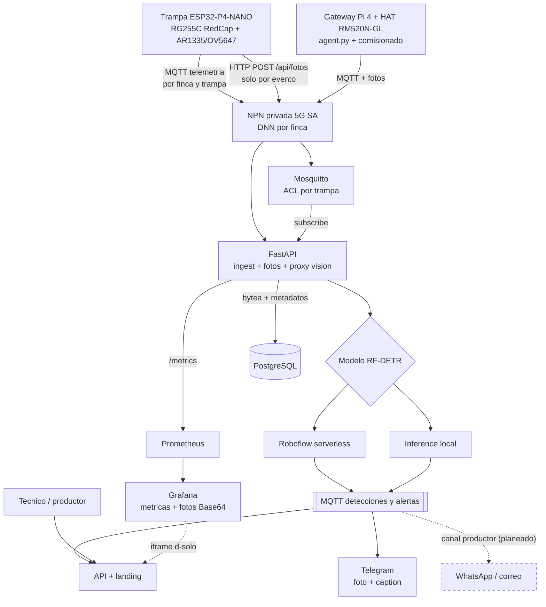
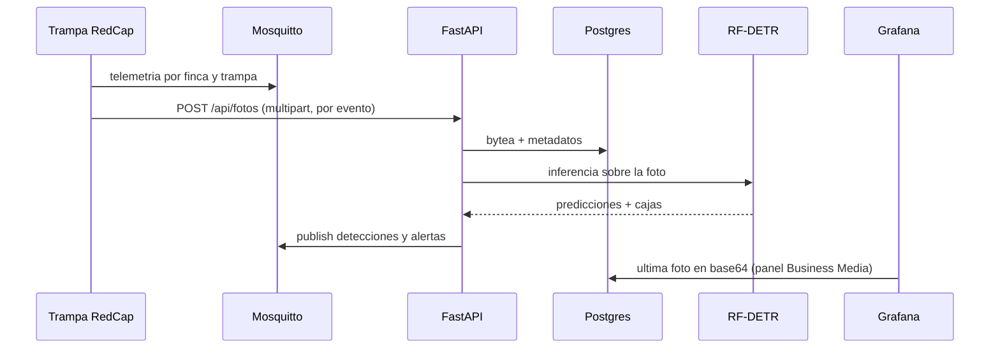

# Arquitectura

Objetivo (lo **planeado** va en línea punteada; el resto existe y corre).

Flujo de la demo hoy (UML secuencia):

Decisiones clave (detalle en `docs/vision-rf-detr.md` del repo):

- **El modelo corre en la nube, no en el edge**: RF-DETR necesita GPU/CPU seria.
- **Mismo código, dos rutas**: `ROBOFLOW_URL` conmuta serverless ↔ self-hosted sin cambiar nada.
- **Backend proxea la key**: nunca va en el frontend ni en el firmware.
- **Degradado limpio**: sin keys, `/api/detect` da 503 y el resto sigue vivo.

## Brechas (roadmap jurado-ready)

| # | Brecha | Qué falta | Desbloquea |
|---|---|---|---|
| 1 | Persistencia ✅ | Postgres + TimescaleDB (hypertables en `telemetry`/`detections`, modelos SQLAlchemy intactos); sobrevive rollouts | Historial, tendencias, métricas honestas |
| 2 | Observabilidad ✅ | `/metrics` + Prometheus + Grafana corriendo; panel de fotos con plugin Business Media | Latencia captura→alerta, SLOs del piloto |
| 3 | Dashboard | Mapa + historial + prioridad (hoy landing + Grafana + API cruda) | El producto que la bitácora promete |
| 4 | Cámara CSI | Sin driver CSI en 2026 (solo probe SCCB); OV5647 valida el pipeline, AR1335 vía adaptador | Detección real en trampa |
| 5 | Telegram ✅ / WhatsApp pendiente | Bot push con foto ante broca (`notify.py`); falta reenvío a WhatsApp/correo | Canal que los entrevistados pidieron |
