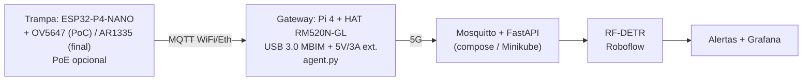
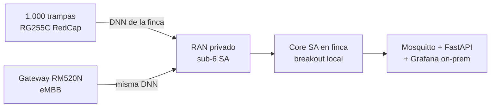
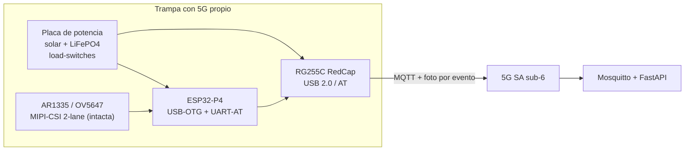

# Decisiones de hardware

Topología elegida con el hardware real (fichas en `reference/hardware/`).

## Decisión 1: RM520N-GL, no RM530N-GL

Sub-6 en Costa Rica, sin mmWave, con certificaciones de operadores americanos y menor precio. Detalle en [ficha comparativa](../reference/hardware/rm520n-gl-vs-rm530n-gl).

## Decisión 2: visión en dos etapas

1. **PoC (hoy)**: OV5647 del KIT-C → el gateway captura y hace `POST /api/detect`; el modelo corre en Roboflow (ya existe).
2. **Final**: AR1335 → captura en el P4 por ESP-IDF (`esp_video` + JPEG) → `POST /api/detect` directo o vía gateway. El backend no cambia (acepta base64).

El firmware MicroPython (`apps/esp-32/`) cubre bring-up + telemetría en ambas etapas; nunca captura (sin driver CSI en 2026).

## Decisión 3: energía y red del gateway

- HAT con alimentación externa 5V/3A (el USB del Pi no sostiene los picos 5G).
- El gateway se registra a la **NPN privada** (SA, PLMN manual) en la DNN de su finca (`agrivision.<customer-id>`); el APN es el del core propio y entra por entorno del host, nunca en git (igual que `WIFI_KEY`/`BALENA_TOKEN` en `balena/balena.sh`).
- `AT+QCFG="usbnet",2` (MBIM) + `AT+QCFG="nat",1` si hay packet-loss tras el dial-up.

## Decisión 5: red privada 5G standalone (NPN, sin operadoras comerciales)

Supuesto del despliegue: la finca opera su propia red 5G SA — RAN propio (gNodeBs según hectáreas/orografía), core SA local con breakout en finca (Mosquitto + backend on-prem, cero dependencia de internet) y SIMs del PLMN privado. Toda la discusión de cobertura/APN/roaming comercial queda fuera.

- **Sin network slicing**: un **DNN por finca/cliente** (`agrivision.<customer-id>`, minúsculas/números/guion, formato 3GPP TS 23.003). Escala con fincas, no con trampas; da aislamiento, contabilidad y breakout por cliente. El `device-id` NO va en el DNN: la identidad del equipo vive en el SIM (SUPI), el tópico MQTT (`agrivision/<cliente>/<finca>/<trampa>/...`) y el TLS por trampa.
- Dentro de la DNN, telemetría vs fotos se separan por 5QI si el core lo soporta; si es best-effort único, la prioridad vive en la app (telemetría siempre, foto solo por evento, MQTT con límites en el broker).
- **Capacidad propia**: 1.000 nodos se planifican en la celda privada (PRACH/RRC dimensionados); `wake_offset_s` y PSM/eDRX se mantienen como buena práctica aunque la celda sea nuestra.
- **SIMs propias**: perfil por trampa, PLMN privado por `AT+COPS` manual; sin portabilidad ni planes comerciales.
- **Riesgos nuevos** (reemplazan a los de cobertura comercial): autorización de espectro ante SUTEL para uso privado, vendor RAN/core con soporte **RedCap R17 real** (verificar: no todo core privado lo trae; eMBB sí), y operación/mantenimiento propios de la red.

- HAT con alimentación externa 5V/3A (el USB del Pi no sostiene los picos 5G).
- APN por entorno del host, nunca en git (igual que `WIFI_KEY`/`BALENA_TOKEN` en `balena/balena.sh`).
- `AT+QCFG="usbnet",2` (MBIM) + `AT+QCFG="nat",1` si hay packet-loss tras el dial-up.

## Decisión 4: 5G en cada trampa (RedCap + rediseño de potencia)

Requisito del despliegue a finca completa (1.000 trampas): cada trampa lleva su módem. No es eMBB por trampa (colapsa celda y batería) sino **RedCap**: Quectel RG255C-GL (ver [ficha](../reference/hardware/rg255c-redcap)). Es además la capacidad 5G que pide el jurado: la guía del hackatón asigna densidad de dispositivos ("1.000 sensores por km²") a **mMTC** (ver [mMTC como escenario](../reference/hardware/mmtc-escenario)), y RedCap es su materialización en hardware para este caso.

- **Potencia**: duty-cycle con load-switches (módem y cámara OFF en sleep, 0 mA). Modelo en `apps/esp-32/drivers/power.py`: ciclo 900 s / ventana 45 s / cámara 5 s → **~3.3 Wh/día** (estimación de datasheet, validar en banco). Batería LiFePO4 12.8V/7Ah (~90 Wh) ≈ 3 semanas sin sol; panel 20W recarga en 2–3 h de sol.
- **MIPI intacta**: solo se gatea la alimentación de la cámara; CSI-2 2-lane, SCCB y timings sin cambios (`drivers/camera.py` sin tocar).
- **Red**: wake desfasado por trampa (`wake_offset_s`, 60 ranuras) para no registrar 1.000 nodos al mismo segundo; PSM/eDRX entre ciclos; telemetría siempre, **foto solo por evento**; coordinación con el operador para la densidad.
- **Firmware**: plano AT en MicroPython (`drivers/modem.py`, probado en CI sin hardware); plano de datos USB-ECM en ESP-IDF (producción). El gateway Pi pasa a rol de comisionado/respaldo donde ya exista.
