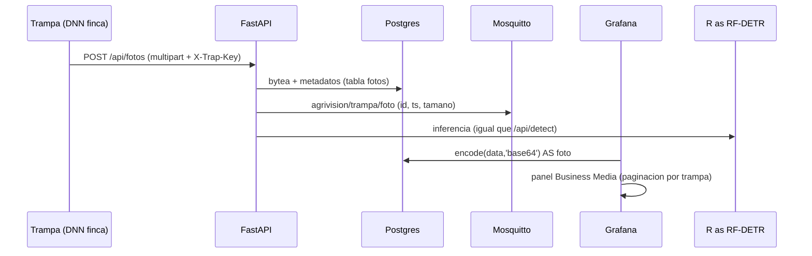

# Pipeline de fotos (trampa → Grafana)

Fuente de verdad del código: `backend/app.py` (`/api/fotos*`), `backend/db.py` (`Foto`), `backend/tests/test_fotos.py`.

## Regla de oro

- **Por Prometheus: NO.** Prometheus guarda números por scrape, no blobs. Una foto por Prometheus = cardinalidad explosiva + TSDB gigante. Por Prometheus solo viajan **métricas** del pipeline (`agrivision_fotos_total{trap_id}`, `agrivision_foto_bytes{trap_id}`).
- **Por MQTT: solo el aviso.** El binario nunca entra al broker. La trampa sube por HTTP y el backend publica el evento.
- **Por HTTP + Postgres + Grafana: SÍ.** Patrón del [video de Volkov Labs](https://youtu.be/hLMtsCWPOg8): binario en base de datos → `encode()` en la query → panel Business Media.

## Flujo

1. `POST /api/fotos` (multipart `file` + form `trap_id`, header `X-Trap-Key` = `FOTO_API_KEY`). Límites: solo `image/*`, máx `FOTO_MAX_BYTES` (10 MB default). Devuelve metadatos `{id, trap_id, ts, size_bytes}`.
2. Lecturas: `GET /api/fotos` (metadatos, filtro `?trap_id=`), `GET /api/fotos/latest?trap_id=` y `GET /api/fotos/{id}` (bytes `image/*`, directo a ``).
3. Auth: sin `FOTO_API_KEY` el endpoint queda abierto con warning (solo dev). En campo es obligatoria (401 sin header).
4. Grafana: dashboard provisionado `AgriVision — Fotos` (`grafana/provisioning/dashboards/fotos.json`) con panel `volkovlabs-image-panel` (se instala solo vía `GF_INSTALL_PLUGINS`). Query: últimas 20 por trampa; paginación, zoom y descarga del panel.

## Escala

Bytea en Postgres vale para demo y piloto. A 1.000 trampas: binario a object storage (S3/MinIO) y en la tabla solo metadatos + URL; el panel Business Media también acepta URL. No cambiar el contrato HTTP ni los tópicos.
