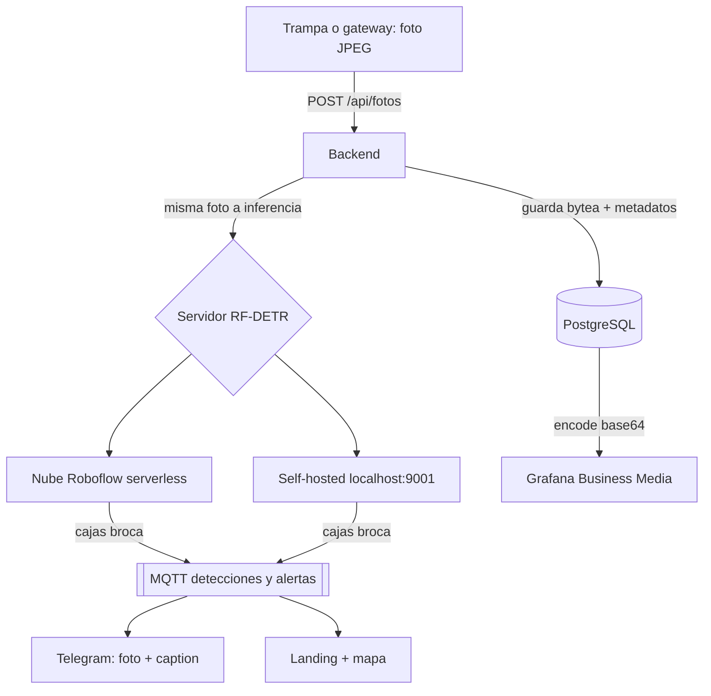

# Visión broca con RF-DETR en Roboflow (clase prioritaria #1)

## Dónde se ejecuta el modelo

**En la nube de Roboflow, no en tu hardware.** Flujo:



- El ESP32-P4 y el Pi no corren RF-DETR (transformer, necesita GPU/CPU seria).
- El backend guarda el binario (bytea) y el resultado; la foto viaja una vez por HTTP, nunca por MQTT.
- Sobre el umbral (`ALERT_CLASSES`, `ALERT_MIN_CONF`): Telegram con foto; el resto sigue a MQTT y Grafana.
- Alternativa futura (con GPU propia): servidor `inference` de Roboflow
  en Docker. No necesaria para el hackathon con 5G.

## Datasets

- **Entrenamiento (imágenes):**
  `universe.roboflow.com/ralph-matthew-r-aquino/coffee-berry-borer`
  (1.9k fotos, segmentación, 1 clase, CC BY 4.0, 0 modelos). Pasos: Fork en
  tu workspace -> Train (RF-DETR, notebook o Roboflow Train) -> Deploy ->
  `ROBOFLOW_MODEL_ID=tu-workspace/coffee-berry-borer/1`. Ojo: son fotos
  close-up estilo burst; validar en tu cafetal bajo sombra (CAFESSIO: el
  0.94 de lab cayó a 0.73 en campo).
- **Fase 2 (tabular, sin visión):** Zenodo 5794727 (conteo de trampas +
  clima Hawái, Johnson & Manoukis 2021). Sirve para alerta de vuelo por
  temperatura (20–26 °C) y humedad, no para entrenar el detector.

## Lecciones del artículo CAFESSIO (2026) aplicadas al dataset

1. El mAP de laboratorio (0.94) cayó a F1 0.73 en campo (Perú, broca).
   Nuestro número válido es el medido **en cafetal bajo sombra**, no en test.
2. No hay dataset público mexicano: hay que capturar fotos propias
   (hojas en planta, luz irregular, varias distancias) y anotarlas en Roboflow.
3. Clases mínimas sugeridas: `broca`, `roya`, `sana`. Separar `broca` (fruto)
   de `roya` (hoja) porque viven en órganos distintos.
4. Validación: reservar fincas completas para test (no solo fotos), para no
   inflar el mAP con hojas del mismo árbol en train y test.

## Decisión: serverless vs self-hosted

| | Serverless (`serverless.roboflow.com`) | Self-hosted (`inference` Docker) |
|---|---|---|
| GPU | La pone Roboflow (auto-escala) | La pones tú (RTX 4050 6GB laptop OK) |
| Costo | Créditos por imagen | Gratis (sin créditos); imagen Docker + tu luz |
| Internet | Obligatorio en campo (5G OK) | Funciona offline / en finca sin señal |
| Latencia | Red + cola compartida | Local, predecible |
| Modelos privados + TensorRT | Incluido | Requiere plan Enterprise (sin él: PyTorch/ONNX) |
| Cuándo | **Demo hackathon y piloto** | Finca sin conectividad, alto volumen, soberanía de datos |

Recomendación: serverless para la demo; en paralelo probar self-hosted
en la laptop (abajo) y decidir con números de latencia/costo. El backend
ya soporta ambas: solo cambia `ROBOFLOW_URL`.

## Probar self-hosted en la laptop (RTX 4050)

```bash
pip install inference-cli inference-sdk
inference server start   # detecta la RTX y levanta http://localhost:9001
# en otra terminal, backend apuntando al servidor local:
ROBOFLOW_URL=http://localhost:9001 ROBOFLOW_API_KEY=<tu-key> \
  ROBOFLOW_MODEL_ID=tu-ws/coffee-berry-borer/1 \
  uvicorn app:app --port 8001  # desde backend/
curl -X POST localhost:8001/api/detect -H 'Content-Type: application/json' \
  -d "{\"trap_id\":\"trap-01\",\"image_base64\":\"$(base64 -w0 foto-campo.jpg)\"}"
```

Mide `time` de inferencia y compáralo contra serverless con la misma foto.

## Llevarlo al HPC Kabré (CENAT)

Kabré (Open OnDemand, SLURM) sirve para dos cosas, ninguna es la demo en vivo:
1. **Fine-tuning RF-DETR con GPU del cluster** (más rápido que Colab gratis).
   Pedir cuenta en kabre.cenat.ac.cr, subir dataset, correr el notebook de
   fine-tuning como job batch (ver `/tutoriales` y la doc readthedocs).
2. **Benchmark de inferencia batch** sobre cientos de fotos de campo para el
   número honesto de precisión (el 0.73 de CAFESSIO se mide así, no en demo).

El modelo entrenado se deploya igual a Roboflow (serverless) o se exporta
a ONNX para el Inference Server. Kabré no sustituye ninguna pieza del
pipeline en vivo: trampa -> gateway -> backend -> inferencia.

| Tópico | Productor | Contenido |
|---|---|---|
| `agrivision/telemetry` | ESP32 / gateway | JSON sensores `{trap_id, temp_c, hum_pct, count}` |
| `agrivision/capturas` | gateway | anuncio de foto (opcional, el agent usa HTTP directo) |
| `agrivision/detections` | backend | resultado RF-DETR `{trap_id, model, detections:[{class, confidence, bbox}], ts}` |
| `agrivision/alertas` | gateway | detecciones sobre umbral (`ALERT_CLASSES`, `ALERT_MIN_CONF`) |

## Configuración

Backend (`backend/`):
- `ROBOFLOW_API_KEY` — Settings > API en app.roboflow.com (va en Secret, nunca en git).
- `ROBOFLOW_MODEL_ID` — ej. `tu-workspace/coffee-berry-borer/1`.
- `ROBOFLOW_CONFIDENCE` — default `0.4` (en campo conviene 0.3–0.5 y calibrar).

En Kubernetes:
```bash
kubectl -n agrivision create secret generic roboflow \
  --from-literal=api-key='TU_API_KEY'
# y ROBOFLOW_MODEL_ID como variable en backend/k8s/agrivision.yaml
```

Endpoints: `POST /api/detect {trap_id, image_base64}`,
`GET /api/detections`, estado en `/health.roboflow`.
